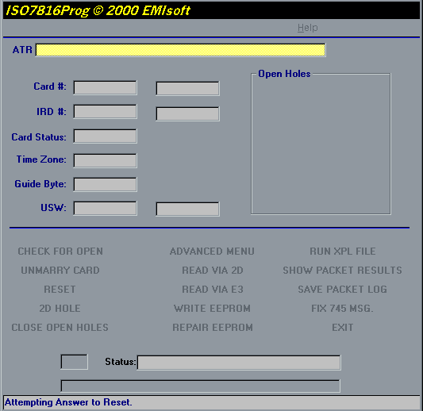



## ISO 7816

### Description

Read and write eeprom on ISO7816 smartcards. Requires an ISO7816 smartcard reader. This program

requires an ISO7816 reader writer which is the hardware required to communicate with the card.

This software performs the actual reading and writing to the smartcard. The hardware can be found on the internet for around $100.00. If you wish to build your own hardware a schematic is attached and parts should be around $30.00. The ISO7816 connects to a serial port and this program interfaces with the serial port. Sample files are included to write to smartcard. Will answer all e-mails in a timely manner. Don't forget to rate this program.
 
### More Info
 

             |
---                |---
**Submitted On**   |2000-10-31 20:07:34
**By**             |[Mark Duhaime](https://github.com/Planet-Source-Code/PSCIndex/blob/master/ByAuthor/mark-duhaime.md)
**Level**          |Advanced
**User Rating**    |4.8 (169 globes from 35 users)
**Compatibility**  |VB 5\.0, VB 6\.0
**Category**       |[Miscellaneous](https://github.com/Planet-Source-Code/PSCIndex/blob/master/ByCategory/miscellaneous__1-1.md)
**World**          |[Visual Basic](https://github.com/Planet-Source-Code/PSCIndex/blob/master/ByWorld/visual-basic.md)
**Archive File**   |[CODE\_UPLOAD112751132000\.zip](https://github.com/Planet-Source-Code/mark-duhaime-iso-7816__1-12514/archive/master.zip)

